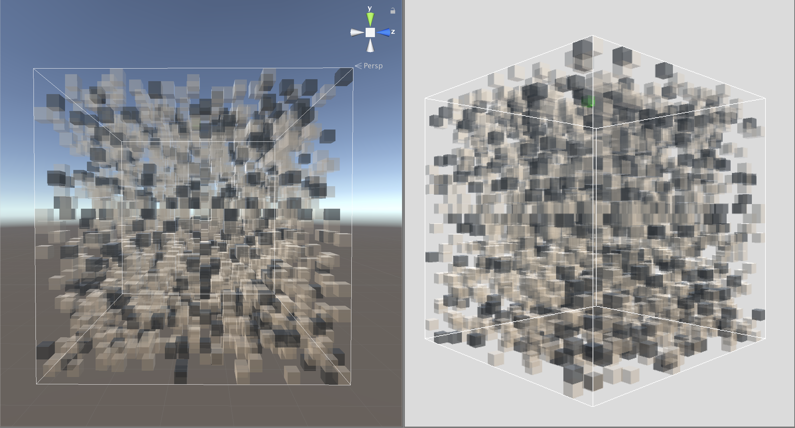
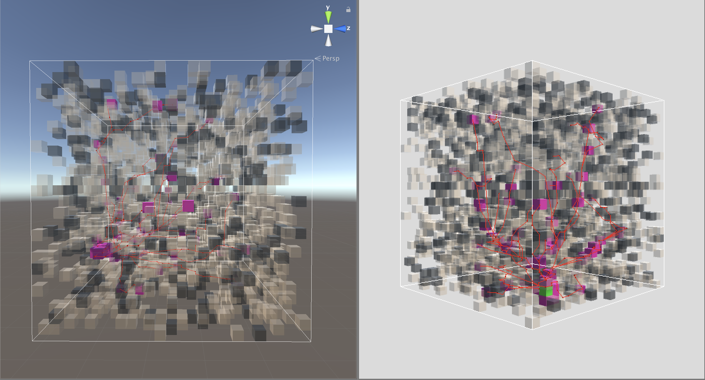

# PathFinding3D
A star pathfinding in 3d grid voxel environment. 
This code has been developed from 2D a star pathfinding method written by Sebastian Lague to 3d voxel environment.

### Parameters
* number of agents
* ratio and number of voxel states; either walkable, semi-walkable or obstacle
* position of the target
* penalty value for semi-walkable region

### Application
This script can be used for multi-agent path finding simulation when the position of the target is predefined

